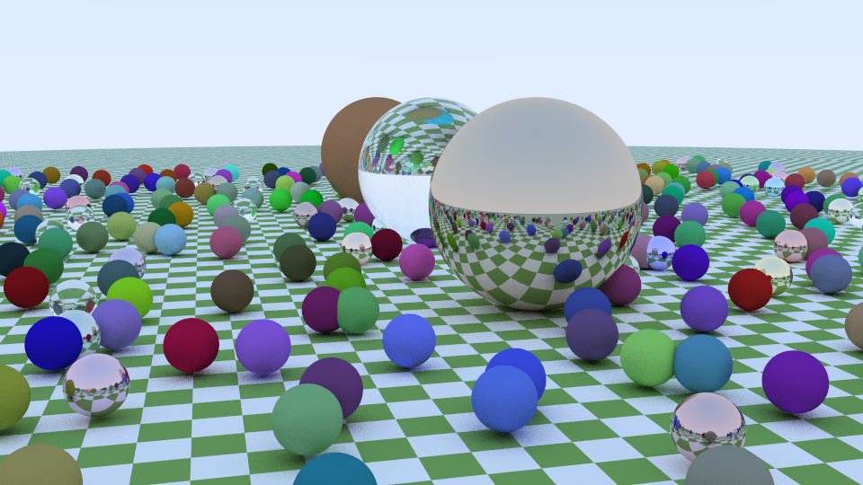

# Firework
A "port" of Peter Shirley's "Ray Tracing in a Weekend" book in Rust. Part 2 of the textbook series is still WIP.

Major changes
- Using ultraviolet for SIMD accelerated `Vec3`
- Nested if statements, loops, etc. replaced by more "rusty" structures (pattern matching, combinators)
- Using `Option`s instead of out parameters.
- Complete refactoring of BVH structure. No pointer arithmatic or unsafe!
- Explicitly passing around Rng object for reproducibility and to prevent side effects
- Separating things out into modules. 

Rendered in 372 s. 
