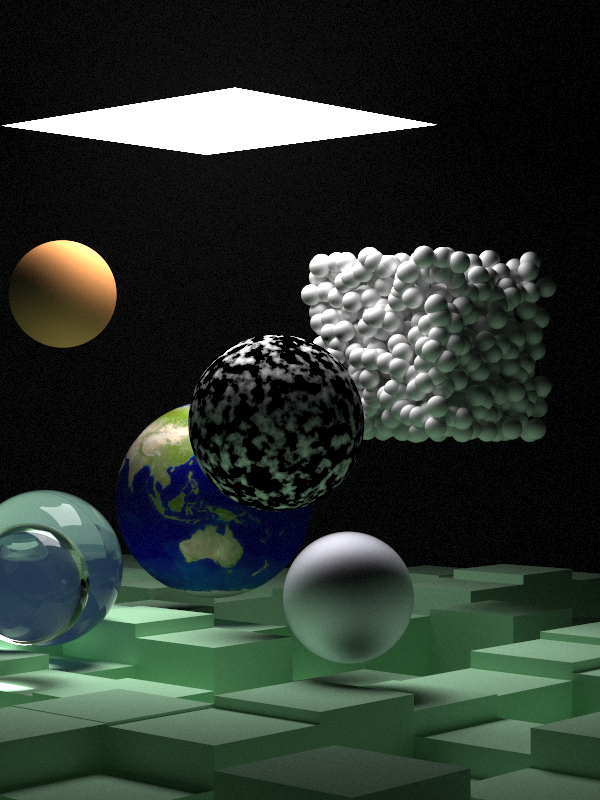

# Firework
A raytracer that I've been working on. Initially, this started as a port of Peter Shirley's "Ray Tracing in a Weekend" book in Rust, but I've added a bunch more features (like support for meshes and HDRs and scene serialization) and radically changed the API (with significant help from [The PBR Book](http://www.pbr-book.org/3ed-2018/contents.html)). 

Major changes
- Using rayon for multithreading
- Using ultraviolet for SIMD accelerated `Vec3`
- Nested if statements, loops, etc. replaced by more "rusty" structures (pattern matching, combinators)
- Using `Option`s instead of out parameters.
- Complete refactoring of BVH structure. No pointer arithmatic or unsafe!
- Explicitly passing around Rng object for reproducibility and to prevent side effects
- Separating things out into modules. 
- Using const_generics to avoid code duplication in Rectangles

Rendered in 3.36 hours.
